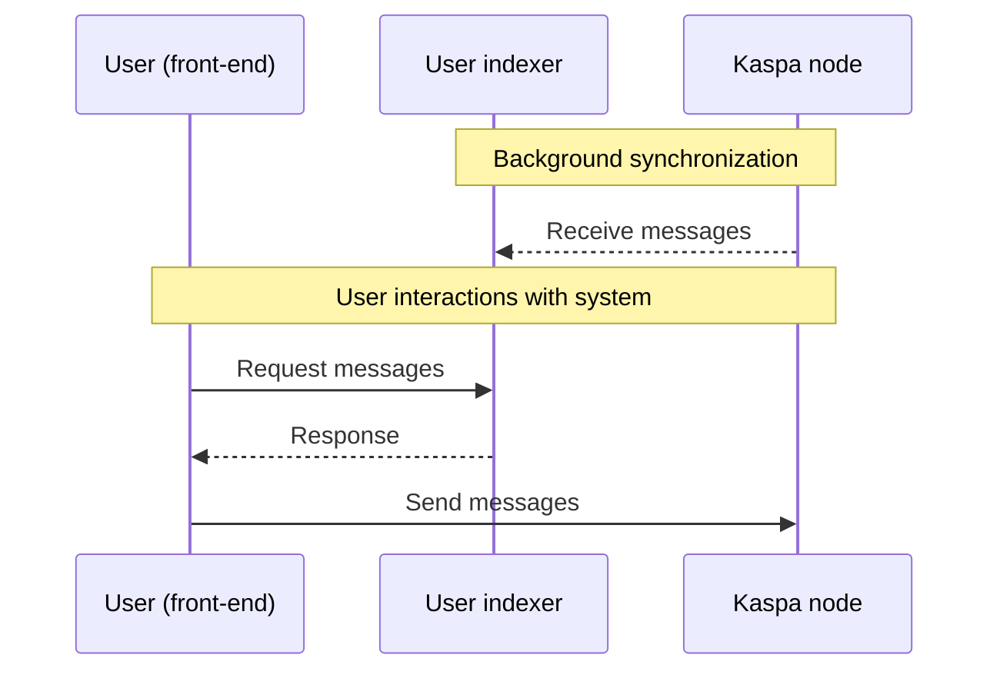
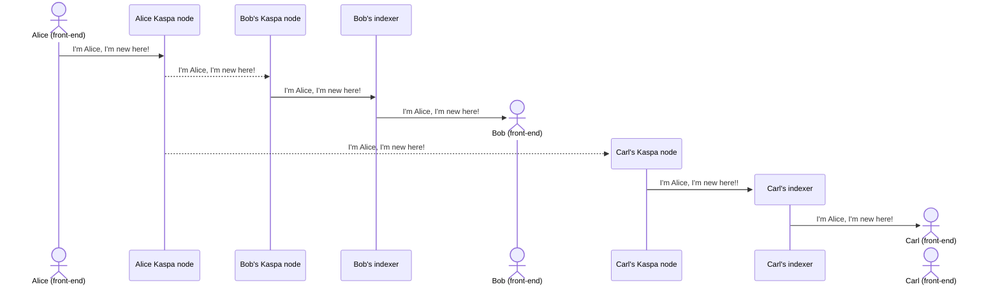
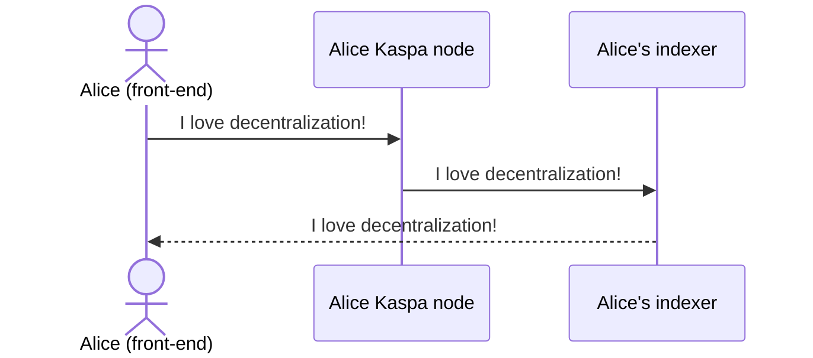
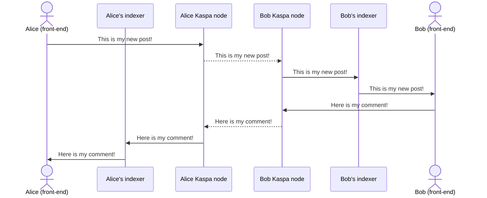
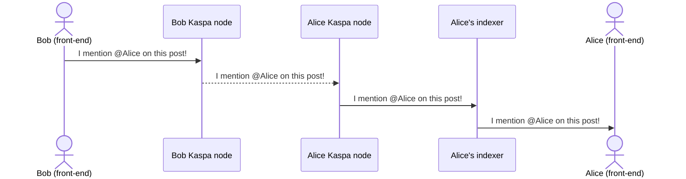
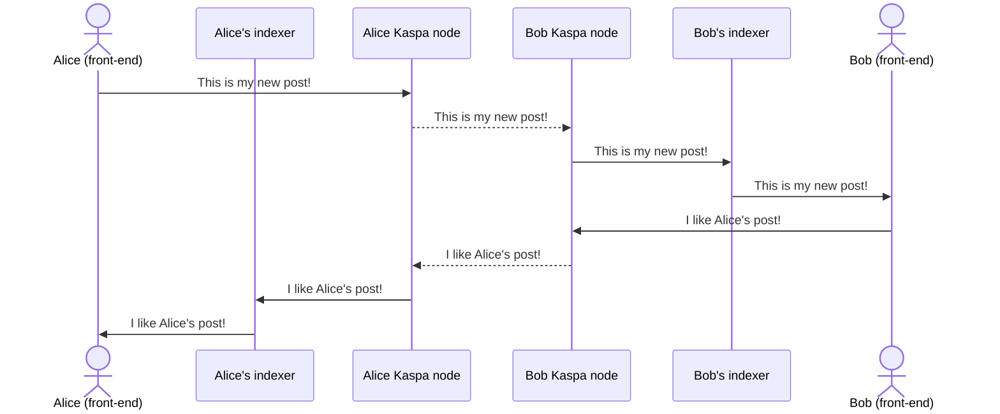
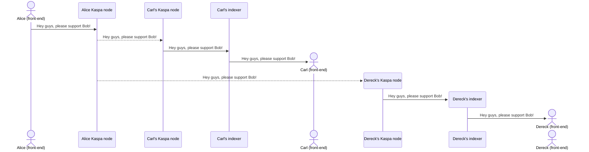

# K - Decentralized social media

## Scope
K is a decentralized microblogging platform running on the top of Kaspa network: it allows people to freely express themselves, without any censorship.


## User journey
Here i describe a high-level user journey including basic features of the app:

###  Creating an account
- User A activates the app for the first time and creates its own "K identity";
- This identity is unique in the whole network and represent only this specific user;
- User A locally backup the required data to restore its account, in case he needs to use it on another clinet;
- After creating its identity, User A fund its account by sending a small amount of KAS from his personal wallet, in order to pay for fees;
- User A broadcast the first message in K network, by informing everyone about his skills, interest, topics of choice, etc; in this way, he's promoting its new activity on the network.

###  Posting the first message
- User A posts his first message on K network, to let everyone know how exciting decentralization and Kaspa are.

###  Following/unfollowing and supporting/unsupporting a user
- User B, who already activated a K account last month, receive the broadcast message from User A and decides to follow him;
- User B activates the "following" process: everytime User A posts something new, User B is alerted and visualize this new content on his K home page;
- User B decides that User A contents are interesting, therefore he chooses to support him;
- When activating the supporting process, User B is sending a certain amount of KAS to User A;
- User A is notified: now he knows User B is supporting him; in addition, everyone else in the network knows User A is supported by User B; 
- In the meantime, User C, another long time K user, received User A broadcast and start following and receiving notifications when User A posts something;
- But User C doesn't like User A contents, therefore he doesn't activate the supporting process and, after few days, he also unfollow User A.

###  Commenting user contents
- User A can setup his own account to:
  - Allow all users to comment his posts;
  - Allow only user who support him to comment his posts;
- User B can freely comment User A content (whether he support User A or not);
- Depending on User A settings (above), User A receive the comment, gets notified about the comment, read the comment or ignore it (not visualizing it).

###  Mentioning other users in posts or comment
- User A can setup his own account to:
  - Allow all users to mention him;
  - Allow only user who support him to to mention him;
- User B can freely mention User A on its posts or comments (whether he support User A or not);
- Depending on User A settings (above), User A receive the mention, gets notified about the mention, read the post/comments including the mention or ignore it (not visualizing it).

###  Reposting/quoting user contents
- User A can setup his own account to:
  - Gets notified if someone repost (forwarding a message, adding considerations) its content;
  - Gets notified if someone quotes (forwarding a message) its content;
- User B can freely repost and quote a User A content in it's own profile (whether he support User A or not);
- Depending on User A settings (above), User A receive the repost/quote, gets notified about the repost/quote, read the repost/quote or ignore it (not visualizing it).

###  Upvoting/downvoting user contents
- User A can setup his own account to:
  - Gets notified if someone upvote/downvote its content;
  - Gets notified if someone quotes upvote/downvote its content;
- User B can freely upvote/downvote a User A content (whether he support User A or not);
- Depending on User A settings (above), User A receive the upvote/downvote, gets notified about the upvote/downvote, see the upvote/downvote or ignore it (not visualizing it).

###  User history
- When User B starts following or supporting (TBD) User A, he'll receive all past contents posted by User A in the past.

###  Blocking users
- Even if User B follow or support User A, User A can freely decide to block User B, blocking notifications related to all main actions (comments, mentions, retweek, quotes);
- User B can freely mention User A and comment, retweek and quote User A contents but User A will never be notified about these actions.

###  Endorsing (suggesting) users
- User A like User B so much that he feels like User B deserve an endorsement, due to the value of his contents;
- User A broadcast an "endorsement" message to all his supporting users, suggesting to follow and support User B;
- All users supporting User A receive a notification which invites them to support User B.


## Main technical requirements
- The app should work both locally (on a PC, for a single user) and hosted (exposed on the internet, for multiple users);
- For a single user, the only requirement to run this app is a local Kaspa node running on mainnet (to be completely decentralized).

## Potential architecture - Actors overview

### Main rule
Each user locally runs its own:
- Kaspa node
- Indexer
- Webapp (frontend)

### Diagram



## Potential architecture - Communication scheme

###  Creating an account
- User A broadcast the first message in K network, by informing everyone about his skills, interest, topics of choice, etc; in this way, he's promoting its new activity on the network.



**Protocol Specifications**

Action: `broadcast`

**Payload Format:**
```
k:1:broadcast:message_body
```

**Message Body Structure:**
```json
{
  "sender_pubkey": "",
  "sender_signature": "",
  "message": ""
}
```

### Example Usage
```
k:1:broadcast:{"sender_pubkey":"abc123","sender_signature":"def456","message":"I'm Alice, I'm new here!"}
```

### Field Descriptions
- `sender_pubkey`: The public key of the message sender
- `sender_signature`: Digital signature for message verification
- `message`: The message to broadcast


###  Posting a message
- User A posts a message on K network, to let everyone know how exciting decentralization and Kaspa are.



**Protocol Specifications**

Action: `post`

**Payload Format:**
```
k:1:post:message_body
```

**Message Body Structure:**
```json
{
  "sender_pubkey": "",
  "sender_signature": "",
  "message": ""
}
```

### Example Usage
```
k:1:post:{"sender_pubkey":"abc123","sender_signature":"def456","message":"I love decentralization!"}
```

### Field Descriptions
- `sender_pubkey`: The public key of the message sender
- `sender_signature`: Digital signature for message verification
- `message`: The message to post


###  Following a user
- User B activates the "following" process: everytime User A posts something new, User B is alerted and visualize this new content on his K home page;

 ```mermaid
sequenceDiagram
    actor B as Bob (front-end)
    B->>Bob's indexer: I want to follow Alice!
    actor A as Alice (front-end)
    A->>Alice Kaspa node: I love Kaspa!
    Alice Kaspa node-->>Bob Kaspa node: I love Kaspa!
    Bob Kaspa node->>Bob's indexer: I love Kaspa!
    Bob's indexer->>B: I love Kaspa!
```
**Protocol specifications**
No protocol definition is required.

###  Supporting a user
- When activating the supporting process, User B is sending a certain amount of KAS to User A and User A is notified.

 ```mermaid
sequenceDiagram
    actor B as Bob (front-end)
    B->>Bob Kaspa node: I support Alice!
    Bob Kaspa node-->>Alice Kaspa node: I support Alice!
    Alice Kaspa node->>Alice's indexer: I support Alice!
    actor A as Alice (front-end)
    Alice's indexer->>A: I support Alice!
```

**Protocol Specifications**

Action: `support`

**Payload Format:**
```
k:1:support:message_body
```

**Message Body Structure:**
```json
{
  "sender_pubkey": "",
  "sender_signature": "",
  "message": "",
  "recipient_pubkey": ""
}
```

### Example Usage
```
k:1:support:{"sender_pubkey":"abc123","sender_signature":"def456","message":"I support Alice!","recipient_pubkey":"xyz987"}
```


###  Commenting user contents
- User B can freely comment User A content (whether he support User A or not).



**Protocol Specifications**

Action: `comment`

**Payload Format:**
```
k:1:comment:message_body
```

**Message Body Structure:**
```json
{
  "sender_pubkey": "",
  "sender_signature": "",
  "message": "",
  "tx_id": ""
}
```

### Example Usage
```
k:1:comment:{"sender_pubkey":"abc123","sender_signature":"def456","message":"Here is my comment!","tx_id": "123456789"}
```


###  Replying other users comments
- User B can freely reply to User A comment (whether he support User A or not).

**Protocol Specifications**

Action: `reply`

**Payload Format:**
```
k:1:reply:message_body
```

**Message Body Structure:**
```json
{
  "sender_pubkey": "",
  "sender_signature": "",
  "message": "",
  "tx_id": ""
}
```

### Example Usage
```
k:1:reply:{"sender_pubkey":"abc123","sender_signature":"def456","message":"Here is my reply!","tx_id": "123456789"}
```


###  Mentioning other users in posts or comment
- User B can freely mention User A on its posts or comments (whether he support User A or not).


TO BE FIXED
**Protocol specifications**

| Action | Parameters | Body |
|--------|------------|------|
| post | user addresses[] | message |
| comment | post ID (tx ID), user addresses[] | message |
| reply | comment ID (tx ID), user addresses[] | message |

Payload examples:
- k:1:post:sender_pubkey:sender_signature:body
- k:1:comment:sender_pubkey:sender_signature:body
- k:1:reply:sender_pubkey:sender_signature:body


###  Reposting/quoting user contents
- User B can freely repost and quote a User A content in it's own profile (whether he support User A or not).

 ```mermaid
sequenceDiagram
    actor A as Alice (front-end)
    participant Alice's indexer
    A->>Alice Kaspa node: This is my new post!
    Alice Kaspa node-->>Bob Kaspa node: This is my new post!
    Bob Kaspa node->>Bob's indexer: This is my new post!
    actor B as Bob (front-end)
    Bob's indexer->>B: This is my new post!
    B->>Bob Kaspa node: I repost/quote Alice's post!
    Bob Kaspa node-->>Alice Kaspa node: I repost/quote Alice's post!
    Alice Kaspa node->>Alice's indexer: I repost/quote Alice's post!
    Alice's indexer->>A: I repost/quote Alice's post!
```

**Protocol Specifications**

Action: `repost`

**Payload Format:**
```
k:1:repost:message_body
```

**Message Body Structure:**
```json
{
  "sender_pubkey": "",
  "sender_signature": "",
  "message": "",
  "tx_id": ""
}
```

### Example Usage
```
k:1:repost:{"sender_pubkey":"abc123","sender_signature":"def456","message":"","tx_id": "123456789"}
```
-----------------------------

Action: `quote`

**Payload Format:**
```
k:1:quote:message_body
```

**Message Body Structure:**
```json
{
  "sender_pubkey": "",
  "sender_signature": "",
  "message": "",
  "tx_id": ""
}
```

### Example Usage
```
k:1:quote:{"sender_pubkey":"abc123","sender_signature":"def456","message":"This is my opinion!","tx_id": "123456789"}
```


###  Upvoting user contents
- User B can freely upvote a User A content (whether he support User A or not).



**Protocol Specifications**

Action: `vote`

**Payload Format:**
```
k:1:vote:message_body
```

**Message Body Structure:**
```json
{
  "sender_pubkey": "",
  "sender_signature": "",
  "tx_id": "",
  "isLiked": true
}
```

### Example Usage
```
k:1:repost:{"sender_pubkey":"abc123","sender_signature":"def456","tx_id": "123456789","isLiked": true}
```

### User history
- When User B starts following or supporting (TBD) User A, he'll receive all past contents posted by User A in the past.

TBD

###  Blocking users
- Even if User B follow or support User A, User A can freely decide to block User B, blocking notifications related to all main actions (comments, mentions, retweek, quotes).

 ```mermaid
sequenceDiagram
    actor A as Alice (front-end)
    A->>Alice's indexer: I want to block Bob!
    participant Alice Kaspa node
    participant Bob Kaspa node
    actor B as Bob (front-end)
    B->>Bob Kaspa node: I'm trying to comment Alice's post!
    Bob Kaspa node-->>Alice Kaspa node: I'm trying to comment Alice's post!
    Alice Kaspa node->>Alice's indexer: I'm trying to comment Alice's post!
```

###  Endorsing (suggesting) users
- User A broadcast an "endorsement" message to all his supporting users, suggesting to follow and support User B;



**Protocol Specifications**

Action: `suggest`

**Payload Format:**
```
k:1:suggest:message_body
```

**Message Body Structure:**
```json
{
  "sender_pubkey": "",
  "sender_signature": "",
  "message": "",
  "recipient_pubkey": ""
}
```

### Example Usage
```
k:1:repost:{"sender_pubkey":"abc123","sender_signature":"def456","message":"Hey guys, please support Bob!","recipient_pubkey":"xyz987"}
```
